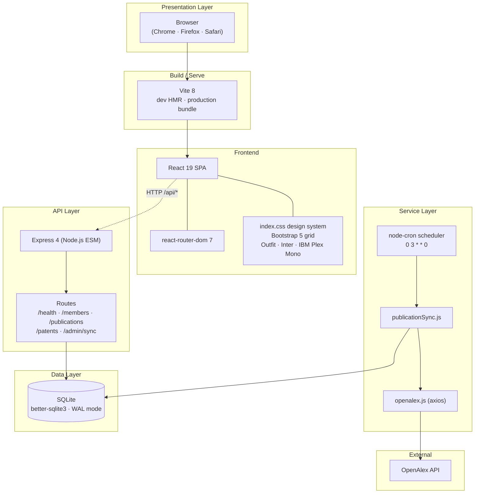
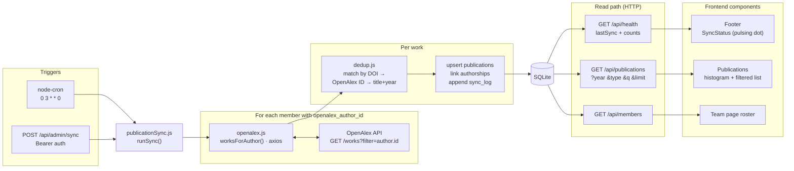

# DeSy — Dependable Systems Website
## Project Documentation

**Authors:** Banu Mihail & Crișan Tudor
**Affiliation:** Faculty of Automation and Computer Science, Technical University of Cluj-Napoca
**Public URL (planned):** http://desy.utcluj.ro
**Repository:** https://github.com/banumihail/Dependabale-Systems-Website
**Document date:** 2026-05-13

---

> **[Figure 1 — Project banner]** *Insert a wide screenshot of the home page hero (after the stagger animation completes), showing the headline "Dependable Systems", the editorial coordinate strip "RG-001 · Cluj-Napoca · UTCN/ACS · Est. 2014", the call-to-action buttons, the four hero stats, and the animated compass mark on the right.*

---

## 1. Project Overview

The DeSy website is the public presentation layer for the **Dependable Systems research group** at the Technical University of Cluj-Napoca, Faculty of Automation and Computer Science. It is a full-stack web application that combines an editorial-engineering visual design with a backend service that keeps the group's publication record continuously up to date by ingesting metadata from **OpenAlex**, an open scholarly database.

The site replaces a previously static page on `desy.utcluj.ro` with:

- a **bilingual-ready single-page application (SPA)** that surfaces the group's identity, members, courses, publications, projects, and services;
- a **lightweight backend service** that automates publication synchronization, eliminating the manual work of maintaining a publication list across 26 researchers;
- a **design system** built around the group's existing navy-and-orange identity, expressed in an editorial-engineering aesthetic (technical mono labels, blueprint hero, numbered sections, corner crosshair marks).

The site is intended both as a public face for the lab and as a maintainable platform that the group can keep current with minimal effort.

---

## 2. Problem Statement and Goals

### 2.1 Problem

Research groups need a public web presence that:
1. Communicates their identity, expertise, and people;
2. Keeps publication records current — historically a manual, error-prone task;
3. Surfaces ongoing work (projects, teaching) in an organized, navigable way;
4. Looks credible at a glance to peers, students, and funding partners.

A static page cannot satisfy point (2) without ongoing manual effort. A traditional CMS adds operational complexity (database backups, plugin updates, security patches) that a small research group cannot reliably absorb.

### 2.2 Goals

| # | Goal | How addressed |
|---|------|---------------|
| G1 | Showcase the group's identity and people | Custom design system, Team page wired to a live `/api/members` endpoint |
| G2 | Maintain a self-updating publication list | OpenAlex synchronization via weekly cron, exposed through `/api/publications` |
| G3 | Allow non-developer updates of editable content | JSON data files (`team.json`, `teaching.json`, `projects.json`) plus seed scripts |
| G4 | Provide a credible, distinctive visual identity | Custom CSS design system, animated hero mark, scroll progress, page transitions, light/dark theme |
| G5 | Keep operational cost near zero | SQLite (single file, no server), Node.js (single process), static frontend build |

---

## 3. Functional and Non-Functional Requirements

### 3.1 Functional requirements

| ID | Requirement |
|----|------------|
| F1 | The site presents an entry page (Home) summarizing the group and its three areas of expertise. |
| F2 | The site lists all team members with role and category filters. |
| F3 | The site displays courses taught by each professor, with course codes. |
| F4 | The site exposes the full publication record with filters by year and type, and free-text search. |
| F5 | The site lists representative projects with funding years and links. |
| F6 | The site enumerates the services offered (R&D, consulting, engineering, training). |
| F7 | Publications are pulled automatically from OpenAlex on a weekly schedule. |
| F8 | An administrator can trigger a sync on demand via a secured admin endpoint. |
| F9 | The site exposes a health/status endpoint reporting record counts and the last sync timestamp. |

### 3.2 Non-functional requirements

| ID | Requirement |
|----|------------|
| NF1 | The frontend must work on modern desktop and mobile browsers without polyfills. |
| NF2 | The site must respect the user's `prefers-reduced-motion` and `prefers-color-scheme` preferences. |
| NF3 | The site must support light and dark themes, persisted across sessions. |
| NF4 | First contentful paint should occur in under one second on typical broadband. |
| NF5 | The backend must tolerate transient OpenAlex API failures (rate-limits, transient 5xx) with retries. |
| NF6 | The publication ingestion must be idempotent (re-running a sync must not duplicate records). |
| NF7 | The codebase must be readable and modifiable by a single developer without specialist tooling (no TypeScript, no build-time CSS framework, no SSR). |

---

## 4. Technology Stack

### 4.1 Frontend

| Layer | Choice | Rationale |
|-------|--------|-----------|
| Framework | React 19 | Industry-standard, large ecosystem |
| Build tool | Vite 8 | Fast HMR, modern ES modules |
| Routing | react-router-dom 7 | Client-side navigation with route transitions |
| Layout | Bootstrap 5 (grid only) | Responsive grid without visual styling |
| Styling | Hand-written CSS with CSS custom properties | Single-file design system, no preprocessor |
| Typography | Outfit (display), Inter (body), IBM Plex Mono (technical labels) | Loaded from Google Fonts |
| Icons | Inline SVG + selective emoji | Lightweight, no icon library dependency |

### 4.2 Backend

| Layer | Choice | Rationale |
|-------|--------|-----------|
| Runtime | Node.js (ES Modules) | Lightweight, broadly available |
| HTTP framework | Express 4 | Minimal, well-understood |
| Database | SQLite via `better-sqlite3` | Single-file, zero-administration, synchronous driver fits a read-heavy site |
| HTTP client | axios | Mature retry/timeout handling |
| Scheduler | node-cron | Standard cron syntax, in-process |
| Configuration | dotenv | Twelve-factor-style environment variables |

### 4.3 Shared

- ESLint flat configuration (`eslint.config.js`)
- Plain JavaScript with JSX — no TypeScript
- No CSS-in-JS, no CSS preprocessor, no utility-class framework
- No external state-management library (React's built-in state suffices)

**Figure 2 — Technology stack diagram.** Layered view of the system, from the user's browser down to the data layer and out to the external OpenAlex API.



---

## 5. System Architecture

The system has three independent runtimes:

1. **The browser**, which renders the React SPA.
2. **The Node.js backend**, which serves a small JSON API and runs a scheduled job.
3. **OpenAlex**, an external API consumed by the backend.

The frontend is a static asset bundle. In development, Vite serves the source files with hot-module reload and proxies `/api/*` calls to the backend. In production, the static bundle is served by a reverse proxy (e.g. Nginx or Caddy), which also forwards `/api/*` to the Node process.

The backend's SQLite database is the single source of truth for members, publications, authorships, patents, and sync logs. The cron scheduler runs the OpenAlex synchronization job on a configurable schedule (default: Sundays at 03:00 server time).

**Figure 3 — Data flow.** Two entry points (the weekly cron and the manual admin trigger) drive a single synchronization routine that pulls from OpenAlex, deduplicates against the local database, and writes through to SQLite. The frontend reads exclusively through HTTP routes that select from the same database.



---

## 6. Frontend Architecture

### 6.1 Routing and pages

The application has six routes, served by a single SPA entry (`src/main.jsx` → `src/App.jsx`). Each route is a top-level page component in `src/pages/`:

| Route | File | Description |
|-------|------|-------------|
| `/` | `Home.jsx` | Hero, contact card, Cloud–Fog–Edge schematic, areas of expertise, quick-links grid |
| `/team` | `Team.jsx` | Filterable roster of 26 researchers, fed by `/api/members` |
| `/teaching` | `Teaching.jsx` | Courses by professor, with a stats strip and course cards |
| `/publications` | `Publications.jsx` | Publication list with year histogram filter, type filter, and search |
| `/projects` | `Projects.jsx` | Vertical list of representative projects with funding years |
| `/resources` | `Resources.jsx` | Four service cards (R&D, consulting, engineering, training) |

Route transitions are animated via a `key={location.pathname}` on the `<main>` element, which causes React to remount the page tree on each navigation, replaying the entrance animation defined in `.page-transition`.

> **[Figure 4 — Page gallery]** *Insert a 2×3 grid of screenshots: Home, Team, Teaching, Publications, Projects, Resources. Captured at desktop width with the dev server running and the database seeded. This is the strongest single visual in the documentation.*

### 6.2 Component organization

```
src/components/
├── Navbar.jsx          fixed top, animated underline links, theme toggle
├── Footer.jsx          four-column footer with sync status indicator
├── ScrollToTop.jsx     resets scroll position on route change
├── ScrollProgress.jsx  2-pixel orange progress bar under the navbar
├── HeroMark.jsx        animated compass mark with cursor-tracked tilt
├── PageCoords.jsx      editorial coordinate strip on inner page headers
├── CountUp.jsx         number-counts-up-from-zero animation
├── SyncStatus.jsx      footer "last sync" indicator with pulsing dot
└── ThemeToggle.jsx     light/dark theme switch with sun/moon icon

src/hooks/
├── useScrollReveal.js  IntersectionObserver-driven .fade-in toggler
└── useTheme.js         theme state + localStorage persistence

src/services/
└── api.js              fetch wrappers for the public API
```

### 6.3 Design system

The design system lives in a single CSS file, `src/index.css`, organized into clearly labeled sections (`/* --- Hero Section --- */`, `/* --- Cards --- */`, and so on). It is built around CSS custom properties declared on `:root`.

**Color palette:**
- Brand: `--desy-orange #E87A1E`, `--desy-orange-light #F5A623`, `--desy-orange-dark #C96510`
- Brand structural: `--desy-navy #1B2A4A`, `--desy-navy-light #2C3E6B`, `--desy-navy-dark #0F1A30`
- Neutrals: `--gray-50` through `--gray-900`
- Accents: `--accent-teal #14B8A6`, `--accent-blue #3B82F6`, `--accent-green #22C55E`

**Typography:**
- `--font-display` / `--font-heading` → **Outfit** — headings, hero, large numbers
- `--font-body` → **Inter** — body copy
- `--font-mono` → **IBM Plex Mono** — labels, breadcrumbs, year codes, statistical readouts

> **[Figure 5 — Brand and typography]** *Insert a single image containing: the color palette as labeled swatches (six brand colors plus accents), and a typographic specimen showing Outfit (large heading), Inter (paragraph), and IBM Plex Mono (uppercase label). Generated easily from a design tool or assembled by screenshotting the hero plus an inner page caption.*

**Reusable patterns:**
- `.section-tag[data-index="01"]` — mono numbered eyebrow with a vertical rule
- `.desy-card.with-marks` — card with four L-shaped corner crosshair marks
- `.page-header` — navy header strip with a faint blueprint grid behind
- `.fade-in` / `.fade-in.visible` — IntersectionObserver-driven scroll reveals
- `.page-coords` — editorial coordinate strip on inner page headers (e.g. `SEC.03 · Publications · N Works · 2014–2026 · OpenAlex`)
- `.hero-coords` — same pattern applied to the home hero (`RG-001 · Cluj-Napoca · UTCN/ACS · Est. 2014`)

### 6.4 Theming (light/dark mode)

The theme system is implemented entirely with CSS custom properties. Two semantic tokens (`--surface-card`, `--text-heading`) plus a remap of the gray ramp under a `[data-theme="dark"]` selector switch the whole site between modes. The user's choice is persisted in `localStorage` (`desy-theme` key); the first-load default is taken from the system `prefers-color-scheme`.

An inline script in `index.html` applies the theme **before** the React bundle paints, eliminating the flash-of-wrong-theme that would otherwise be visible to dark-mode users.

> **[Figure 6 — Light vs dark mode]** *Insert a side-by-side comparison of the same page (e.g. Home or Publications) in light mode (left) and dark mode (right). The hero and footer should look unchanged; the mid-page cards and surfaces should be visibly inverted.*

### 6.5 Motion and interactivity

- **Hero stagger.** On first paint, the hero elements fade and rise sequentially: coordinate strip → headline → subtitle → CTA buttons → stats → compass mark.
- **Compass mark interaction.** The compass (`HeroMark.jsx`) tilts in 3D toward the cursor via CSS perspective transforms. On hover it accelerates ring rotation, brightens strokes, and reveals a radar sweep.
- **Scroll progress.** A 2-pixel orange bar at the top of the viewport reflects scroll depth via `transform: scaleX()`.
- **Count-up stats.** The four hero stats animate from 0 to their target value over 900ms with an `easeOutCubic` curve, triggered by an `IntersectionObserver` when the hero enters the viewport.
- **Histogram bars.** Year bars on the Publications page rise from zero with a staggered animation, mapping their height to the publication count for that year.
- **Page transitions.** Each route change fades and lifts the page tree by 10 pixels over 0.45 seconds.

All motion is suppressed when the user has `prefers-reduced-motion: reduce` set.

> **[Figure 7 — Compass mark detail]** *Insert a close-up of the animated compass mark from the hero, ideally at the moment the cursor is hovering and the radar sweep is visible. A two-frame composite (idle vs hovered) is also acceptable.*

> **[Figure 8 — Publications histogram]** *Insert a screenshot of the Publications page showing the year histogram with at least one bar selected (highlighted in orange) and the list filtered below.*

---

## 7. Backend Architecture

### 7.1 Process structure

The backend is a single Express process (`backend/src/index.js`) that:
1. Connects to a SQLite database (creating the file if it does not exist).
2. Registers HTTP route handlers under `/api/*`.
3. Starts a node-cron scheduler that triggers the publication sync at the configured time.
4. Handles `SIGINT` / `SIGTERM` for graceful shutdown.

### 7.2 Modules

```
backend/src/
├── index.js                  Express bootstrap, health endpoint, graceful shutdown
├── config/env.js             dotenv loader with explicit defaults
├── db/
│   ├── database.js           getDb() / closeDb() singleton wrapper
│   └── schema.sql            full schema applied at startup
├── routes/
│   ├── members.js            GET /api/members
│   ├── publications.js       GET /api/publications and /api/publications/:id
│   ├── patents.js            GET /api/patents
│   └── admin.js              POST /api/admin/sync, GET /api/admin/sync-log (Bearer)
├── scheduler/cron.js         node-cron registration
├── services/
│   ├── openalex.js           thin axios wrapper, polite-pool email, exponential backoff
│   ├── authorResolver.js     match members → OpenAlex author IDs
│   ├── publicationSync.js    the main ingestion routine
│   └── seed.js               import members and legacy publications from src/data/*.json
└── utils/
    ├── dedup.js              DOI / title normalization for deduplication
    └── logger.js             timestamped console logger
```

### 7.3 Public API

| Method | Path | Auth | Description |
|--------|------|------|-------------|
| GET | `/api/health` | — | Record counts and last sync metadata |
| GET | `/api/members` | — | All members, ordered by category then id |
| GET | `/api/publications` | — | Publications, paginated, with query filters |
| GET | `/api/publications/:id` | — | Single publication with author list |
| GET | `/api/patents` | — | All patents |
| POST | `/api/admin/sync` | Bearer | Trigger an OpenAlex sync immediately |
| GET | `/api/admin/sync-log` | Bearer | History of past sync runs |

Admin endpoints require an `Authorization: Bearer <ADMIN_TOKEN>` header. The token is configured via the backend `.env` file.

### 7.4 Database schema

Five tables and a metadata key-value store:

- **`members`** — researchers. Includes role, category, profile link, and an optional OpenAlex author identifier used by the sync routine.
- **`publications`** — works ingested from OpenAlex (or seeded from legacy JSON). The `openalex_id` and `doi` columns are unique; the `title_normalized` column is used for fallback deduplication when neither identifier is available.
- **`authorships`** — many-to-many link between publications and members, retaining the author position (`first`, `middle`, `last`) and the original display name.
- **`patents`** — flat patent list (authors, title, reference).
- **`sync_log`** — one row per sync run, recording status, counts, and serialized errors.
- **`meta`** — generic key-value table for sync cursors and small configuration.

The database is opened in WAL mode (`PRAGMA journal_mode = WAL`), permitting concurrent reads while a sync is writing.

> **[Figure 9 — Database schema diagram]** *Insert an entity-relationship diagram showing members, publications, authorships (junction), patents, sync_log, and meta with their key columns and relationships. Can be hand-drawn or generated from a tool like dbdiagram.io.*

### 7.5 OpenAlex synchronization

The sync routine (`backend/src/services/publicationSync.js`) iterates over every member with a resolved `openalex_author_id`, fetches all works for that author from OpenAlex using a cursor-paginated query, maps each work to the local schema, and upserts it into the database. Deduplication priority: DOI > OpenAlex identifier > normalized title + year.

For each work, an authorship row is created for every group member who appears in the OpenAlex authorship list. The OpenAlex `mailto` parameter is set to a contact email (`OPENALEX_EMAIL`), placing the requests in OpenAlex's polite-pool routing tier. Transient HTTP failures (429 or 5xx) are retried with exponential backoff up to four times.

Every sync run records a row in `sync_log` with status (`ok`, `partial`, or `failed`), counts of added and updated publications, the number of members processed, and a JSON-encoded list of errors. The footer's sync indicator (`SyncStatus.jsx`) reads this row through `/api/health` and displays a relative timestamp.

> **[Figure 10 — Footer sync status indicator]** *Insert a close-up screenshot of the footer's last-sync line: "Last OpenAlex sync · X days ago · ●" with the pulsing green dot. Crop tightly to the bottom of the page.*

---

## 8. Data Management

### 8.1 Editable content

| Source | Maintained by | Update mechanism |
|--------|---------------|-------------------|
| `src/data/team.json` | Hand-edited | Edit file, run `npm run db:seed` |
| `src/data/teaching.json` | Hand-edited | Edit file, page hot-reloads |
| `src/data/projects.json` | Hand-edited | Edit file, page hot-reloads |
| `src/data/publications.json` | Legacy seed (do not edit) | Backend OpenAlex sync supersedes it |

### 8.2 Seed and sync scripts

Run from `backend/`:

```
npm run db:init           Apply schema (idempotent)
npm run db:seed           Import members + legacy publications from src/data/*.json
npm run authors:resolve   Backfill OpenAlex author IDs for each member
npm run sync:once         One-time pull of fresh publications from OpenAlex
```

The cron schedule defaults to `0 3 * * 0` (Sundays, 03:00). It is configurable via `CRON_SCHEDULE` in `backend/.env`.

---

## 9. Development Workflow

### 9.1 Local setup

```
git clone https://github.com/banumihail/Dependabale-Systems-Website
cd Dependabale-Systems-Website
npm install                       # frontend dependencies
cd backend && npm install         # backend dependencies
```

### 9.2 Running the application

Two terminals are needed in development:

```
Terminal A (backend):    cd backend && npm run dev       → http://localhost:3001
Terminal B (frontend):   npm run dev                     → http://localhost:5173
```

Vite proxies `/api/*` from the dev server to the backend, so the frontend talks to the API on the same origin transparently.

### 9.3 Configuration

The backend reads configuration from `backend/.env`:

```
PORT=3001
NODE_ENV=development
OPENALEX_EMAIL=...                       # polite-pool contact
ADMIN_TOKEN=<long random secret>         # Bearer token for /api/admin/*
CRON_SCHEDULE=0 3 * * 0                  # node-cron syntax
CORS_ORIGINS=http://localhost:5173       # comma-separated allowed origins
DB_PATH=data/desy.db                     # SQLite file path
```

### 9.4 Production build

```
npm run build                            # outputs to dist/
npm run preview                          # local preview of the built bundle
```

The production deployment plan is a reverse proxy (Nginx or Caddy) on `desy.utcluj.ro` serving the `dist/` static bundle and forwarding `/api/*` to the Node process.

---

## 10. Key Features Implemented

The following list summarizes the substantial features in the current version. Each item is implemented end-to-end (frontend + backend where applicable) and exercised in the live site.

1. **Animated hero with compass mark** — three concentric rotating dashed rings, counter-rotating inner nodes, cursor-tracked 3D tilt, hover radar sweep, full motion-reduction support.
2. **Editorial coordinate strip** — `RG-001 · Cluj-Napoca · UTCN/ACS · Est. 2014` on the hero, `SEC.NN · Page · Live count · Accent` on every inner page header, sharing one `PageCoords` component.
3. **Count-up statistics** — the four hero stats animate from zero to their target over 900 ms with `easeOutCubic`, triggered by an `IntersectionObserver`.
4. **Scroll progress bar** — a 2-pixel orange bar at the top of the viewport reflects scroll depth, persistent across pages.
5. **Route page transitions** — every navigation fades and lifts the page tree using a `key={location.pathname}` strategy.
6. **Animated underline navbar** — links underline from center on hover; the active link sits at full width.
7. **Light and dark theme** — semantic CSS custom properties remap the gray ramp under `[data-theme="dark"]`; user choice persists in `localStorage`; first-load default tracks system preference; anti-flash inline script applies the theme before paint.
8. **Publication year histogram filter** — interactive bar chart computed from all publications; clicking a bar filters the list; clicking "All years" clears the filter.
9. **Type filter and live search** — publications can be filtered by type (journal / conference) and narrowed by a fuzzy client-side search on title, authors, or journal.
10. **Last-sync indicator** — the footer displays a relative timestamp from `/api/health` with a pulsing green dot (or red when the last sync failed).
11. **OpenAlex synchronization** — full publication ingestion with deduplication, polite-pool routing, exponential-backoff retries, and a persistent sync log.
12. **Admin trigger** — a Bearer-protected `POST /api/admin/sync` endpoint allows a manual refresh without restarting the process.

---

## 11. Testing and Verification

The application was verified through:

- **Manual visual review** of every page at desktop, tablet, and mobile widths.
- **Compilation checks.** `npm run build` was run after every significant change to confirm the production bundle compiled without errors.
- **Linter.** `npx eslint src` was run periodically; the codebase carries two pre-existing `react-hooks/exhaustive-deps` warnings in `useScrollReveal.js`, deemed harmless.
- **Backend smoke tests.** The OpenAlex sync routine was executed against the live API and its results inspected in `sync_log`.
- **Theme-switch sanity.** Both light and dark themes were verified on every page after the dark-mode work, with attention to navy-on-navy collisions (year badge, active filter pill, footer).
- **Reduced-motion checks.** Animations were verified to be suppressed under `prefers-reduced-motion: reduce`.

The project does not currently include an automated test suite. Given the small surface area of the backend and the visual nature of the frontend, manual verification was judged appropriate for the project's scope.

> **[Figure 11 — Mobile / responsive view]** *Insert a screenshot of the site viewed at mobile width (≤ 576px), ideally showing the home hero collapsed to a single column with the navbar's hamburger menu visible. A second crop with the menu expanded is also useful.*

---

## 12. AI Tools Usage Disclosure

This section discloses, explicitly and completely, the use of AI assistance in the development of the website.

### 12.1 Tool, model, and scope

- **Tool:** Claude Code — Anthropic's official command-line interface for AI-assisted development. Claude Code is an interactive agent that can read and edit local files and run shell commands under user supervision.
- **Model:** Claude **Opus 4.7** (`claude-opus-4-7`).
- **Sessions:** Two iterative sessions during the project, totaling approximately four hours of interaction. All work was done with the AI tool integrated locally; no project code was uploaded to a remote AI service.

### 12.2 What AI assisted with

| Area | AI contribution | Human review |
|------|-----------------|--------------|
| Frontend redesign (visual system) | Drafted CSS variables, component styles, layout patterns | Each visual change was reviewed in-browser and accepted, redirected, or reverted |
| Hero compass mark (`HeroMark.jsx`) | Generated the SVG geometry and the cursor-tilt logic | Reviewed; accepted with no changes |
| Publication histogram filter | Designed the histogram component and the click-to-filter behavior | Tested against real data; accepted |
| Teaching page | Created `Teaching.jsx` and `teaching.json` (placeholder courses) | Layout accepted; course content filled in by hand |
| Page transitions and scroll progress | Implemented the `key`-based remount strategy and the progress bar | Reviewed |
| Editorial coordinate strip (`PageCoords.jsx`) | Generated the reusable component and per-page segment definitions | Accepted with light editing |
| Count-up animation (`CountUp.jsx`) | Generated the IntersectionObserver + requestAnimationFrame implementation | Reviewed |
| Footer sync status (`SyncStatus.jsx`) | Generated the component, relative-time helper, and pulsing-dot CSS | Reviewed |
| Dark mode (CSS custom property system, `useTheme.js`, `ThemeToggle.jsx`) | Generated the semantic-token approach, the `[data-theme="dark"]` overrides, and the anti-flash inline script | Verified visually across every page |
| This documentation file | Drafted from the project state and prior handoff notes | Reviewed |

### 12.3 What AI did *not* touch

- The original site scaffold and earlier static-site work.
- The backend modules pre-existing the AI session (Express setup, OpenAlex sync routine, SQLite schema, cron registration, admin routes, seed scripts).
- Content data: `src/data/team.json`, `src/data/projects.json`, `src/data/publications.json` were authored by hand. `src/data/teaching.json` was generated by AI with placeholder entries; real course content was filled in manually.
- No external code, blog posts, or third-party tutorials were copied into the project.
- No third-party JavaScript libraries were added during the AI sessions.

### 12.4 Representative prompts used

The following prompts (paraphrased lightly for clarity, preserving intent) illustrate how the AI was directed during the sessions:

1. *"I want everything new pushed to the GitHub repository — do not add Claude as a co-author on commits."*
2. *"Add a count-up animation on the hero stats (0 → target over ~900 ms when the hero enters the viewport, pure useEffect + requestAnimationFrame, no library), a footer indicator that pulls `/api/health` and shows the last OpenAlex sync with a pulsing green dot, and a full dark mode for the site."*
3. *"What other design moves would you recommend? I'm thinking of something for a more polished look — the features are enough for now."*
4. *"Yes, add the editorial coordinate strip on inner page headers."*
5. *"I need a documentation file. Write a full project documentation, more thorough than the simple version. I also need to mention where AI was used (prompts, resources, final version), and indicate where pictures should go because it will be written in a .docx."*

Prompts and AI responses were directional rather than authoritative: every suggestion was evaluated, and design choices were accepted, redirected, or rejected on the basis of fit with the brand and the page's intent.

### 12.5 Examples of accepted, refined, and rejected AI suggestions

- **Accepted as proposed:** the compass mark, the histogram filter, the page-transition mechanism, the count-up component, the sync indicator, the dark-mode token strategy, the coordinate-strip pattern.
- **Accepted then refined:** the hero composition (originally housed the teaching panel; relocated after my feedback), the section-tag numbering, the quick-links grid (expanded to four cards to include Teaching).
- **Rejected entirely:** an early proposal to switch the primary typography to a Fraunces serif with italic accents. The proposal was reverted to the existing Outfit + Inter + IBM Plex Mono combination on direct feedback.

### 12.6 External resources

- **Google Fonts** — Outfit, Inter, IBM Plex Mono — loaded via `<link>` in `index.html`. No font files are bundled with the repository.
- **Bootstrap 5** — used for the responsive grid only. No Bootstrap components are themed or extended.
- **OpenAlex** — public scholarly metadata API, consumed by the backend.
- No other web pages, code samples, or AI services were used.

### 12.7 Verification performed on AI output

For every AI-generated or AI-modified file:

- the Vite hot-reload log was watched for compilation errors;
- `npm run build` was run periodically to confirm the production bundle compiled cleanly;
- each affected page was visually reviewed in the browser, in both light and dark modes;
- code diffs were read before being committed.

### 12.8 Final version

The current repository on the `main` branch represents the **AI-assisted, human-reviewed** version of the site. Each AI-generated change is either accepted as-is, refined through follow-up prompts, or replaced with a hand-written alternative. The documentation explicitly distinguishes machine-generated artifacts (which are clearly attributable in commit history) from hand-written content (data files, configuration, the original scaffold).

Suggested phrasing for a spoken disclosure during a viva or presentation:

> "The frontend redesign, the dark mode implementation, the editorial coordinate strip system, and this documentation were produced with Claude Code (Anthropic, Opus 4.7) over two iterative sessions. AI proposed and drafted; I directed the design, accepted or rejected each change, filled in factual content, and verified everything visually and via the build. The backend service, the data files, and the original scaffold pre-dated the AI sessions. No external code was copied in."

---

## 13. Known Limitations and Future Work

### 13.1 Known limitations

- **No automated test suite.** Verification relies on manual checks and the production-build compile gate.
- **No deployment artifact.** No Dockerfile, no CI/CD pipeline, no reverse-proxy template; deployment to `desy.utcluj.ro` remains to be configured.
- **No GDPR consent banner.** Required before a public launch in the EU.
- **No 404 page.** Unknown routes currently render an empty layout instead of a friendly error page.
- **No per-route SEO metadata.** A single global `<title>` and meta description in `index.html` covers the whole site.
- **No server-side rendering.** All pages render client-side; search engines that do not execute JavaScript will see an empty document.
- **Backend admin token must be rotated** before public deployment and the `.env` file must be excluded from version control.

### 13.2 Future work

The following features would be natural next steps and would substantially increase the site's utility:

1. **BibTeX export per publication** — a one-click "copy citation" button on each publication item.
2. **DOI / PDF / OpenAlex link icons** — one-click access to the artifact itself.
3. **Member detail pages** — `/team/:slug` showing role, contact, and publications filtered to the member.
4. **"Recently added" badge** on publications synced in the last seven days.
5. **System-status card on the home page** — front-and-center display of total publications, members, projects, and last-sync time.
6. **Open-Graph and Twitter-card meta tags** — for shared-link previews.
7. **Skeleton loaders** for the Publications and Team pages while API data is fetched.
8. **Per-section figure rules** — editorial hairlines labeled `Fig. NN` between major page sections.

---

## 14. Conclusion

The DeSy website demonstrates that a small research group can maintain a credible, distinctive, and self-updating public web presence with minimal operational overhead. The system has three deliberately independent parts — a React SPA, a Node.js + SQLite service, and an external scholarly metadata API — connected by a small JSON contract and a scheduled job. The visual design favors a technical, editorial aesthetic that reflects the group's domain (dependability, security, cyber-physical systems) rather than adopting a generic academic template.

The work also illustrates a disciplined use of AI assistance: the AI was directed as a draftsman, not an oracle; every generated artifact was reviewed, accepted, refined, or rejected; and the resulting codebase is comprehensible without specialist tooling.

> **[Figure 12 — Final composite]** *Insert a single high-resolution screenshot or short composite of the finished site that you would be comfortable putting on the last page of the .docx as a closing image. Suggested choice: the home hero in dark mode, with the compass mark visible.*

---

*Document maintained alongside the repository at https://github.com/banumihail/Dependabale-Systems-Website. Last updated 2026-05-13.*
